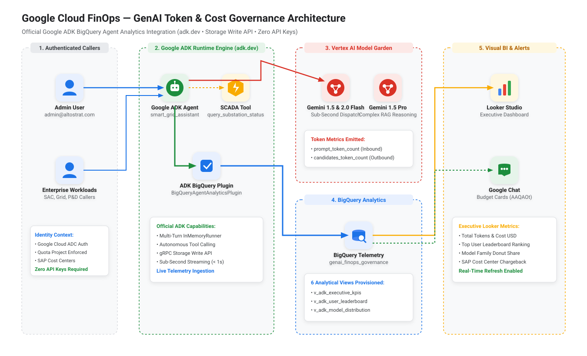
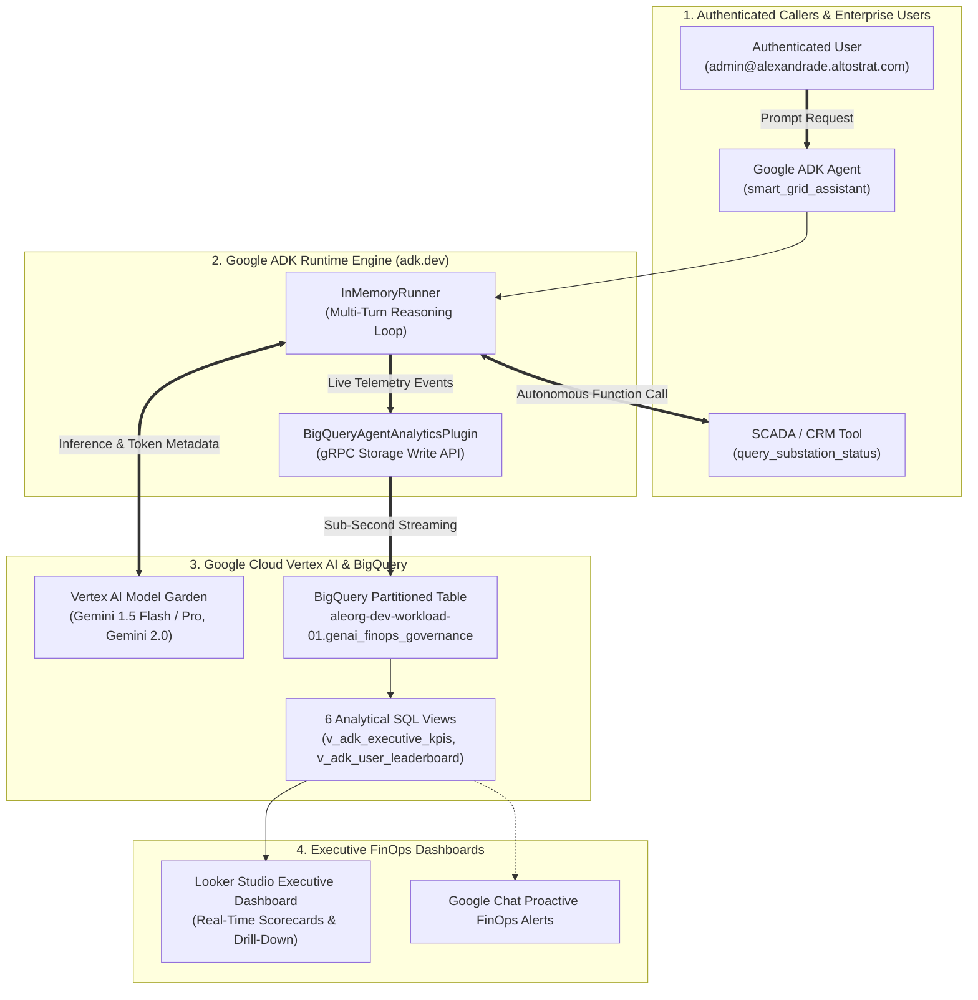

# 🧠 GenAI Token & Cost Governance with Official Google ADK

[](https://cloud.google.com)
[](https://adk.dev)
[](https://cloud.google.com/vertex-ai)
[](https://cloud.google.com/bigquery)
[](https://lookerstudio.google.com)

**Enterprise Engagement:** Google Cloud PSO — FinOps & GenAI Governance  
**Environment:** Argolis (`aleorg-dev-workload-01` | Org ID: `1068294623135`)  
**Official Reference:** [Google Agent Development Kit (ADK) — BigQuery Agent Analytics](https://adk.dev/integrations/bigquery-agent-analytics/)

---

## 📋 Table of Contents
1. [Executive Overview & Value Proposition](#-1-executive-overview--value-proposition)
2. [End-to-End Architecture](#-2-end-to-end-architecture)
3. [Real-Time Storage Write API vs. Billing Latency](#-3-real-time-storage-write-api-vs-billing-latency)
4. [Quickstart: Setup & Prerequisites](#-4-quickstart-setup--prerequisites)
5. [How to Generate REAL Altostrat Token Telemetry](#-5-how-to-generate-real-altostrat-token-telemetry)
6. [How to Generate High-Volume MOCK / Synthetic Datasets (500M+ Tokens)](#-6-how-to-generate-high-volume-mock--synthetic-datasets)
7. [How to Erase / Reset BigQuery Data](#-7-how-to-erase--reset-bigquery-data)
8. [BigQuery Schema & Analytical Views](#-8-bigquery-schema--analytical-views)
9. [Executive Looker Studio Dashboard Setup](#-9-executive-looker-studio-dashboard-setup)
10. [CLI Command & Flag Reference](#-10-cli-command--flag-reference)

---

## 🎯 1. Executive Overview & Value Proposition

As enterprise teams scale Generative AI agents on Google Cloud (Vertex AI Gemini 1.5/2.0, Claude, Search & RAG), CFOs and FinOps teams face two critical blindspots:
1. **Billing Latency**: Standard Cloud Billing exports take **4 to 24 hours** to settle, preventing real-time anomaly detection.
2. **Missing Token Attribution**: Standard billing shows total Vertex AI cost, but cannot attribute costs to individual **Agent Names**, **Tool Calls**, **SAP Cost Centers**, or **End-User Email Callers**.

### The Solution: Official Google ADK BigQuery Analytics
By integrating the official **`BigQueryAgentAnalyticsPlugin`** from the [Google Agent Development Kit (ADK)](https://adk.dev), every multi-turn prompt, candidate token, tool invocation, and latency span is streamed **in sub-second real time (< 1s)** directly to BigQuery via the gRPC **BigQuery Storage Write API**, with **Zero API Keys** required (100% IAM & ADC authenticated).

---

## 🏗️ 2. End-to-End Architecture

<p align="center">
  
</p>



---

## ⚡ 3. Real-Time Storage Write API vs. Billing Latency

| Feature | Standard GCP Cloud Billing Export | Official ADK BigQuery Agent Analytics |
| :--- | :--- | :--- |
| **Ingestion Latency** | **4 to 24 Hours** (Batch reconciliation) | **Sub-Second (< 1000 ms)** (gRPC streaming) |
| **Granularity** | Project & SKU level aggregated cost | **Per-prompt, per-candidate, per-tool call, per-user** |
| **Tool Calling Telemetry** | ❌ None | ✅ Tool execution duration, status & parameters |
| **SAP Cost Center Chargeback**| Requires static project label tags | ✅ Dynamic run-time business attribution |
| **Authentication** | Cloud Billing Admin | **Google Cloud ADC / IAM (Zero API Keys)** |

---

## 🚀 4. Quickstart: Setup & Prerequisites

### Step 1: Clone Repository
```bash
git clone git@github.com:aleandrade-labs/genai-token-governance.git
cd genai-token-governance
```

### Step 2: Create Python Virtual Environment
```bash
python3 -m venv .venv
source .venv/bin/activate
pip install -r requirements.txt
```

### Step 3: Authenticate with Google Cloud ADC (Zero API Keys!)
```bash
gcloud auth application-default login
gcloud auth application-default set-quota-project aleorg-dev-workload-01
gcloud config set project aleorg-dev-workload-01
```

---

## 👤 5. How to Generate REAL Altostrat Token Telemetry

Run the official Google ADK agent natively using your authenticated **`admin@alexandrade.altostrat.com`** account:

### Option A: Single Interactive Multi-Turn Prompt
```bash
.venv/bin/python3 src/run_official_adk_agent.py
```
- **What happens**:
  1. ADK Agent receives prompt: *"Verifique o status da Subestação Frei Caneca (SUB-RJ-FC-01)"*.
  2. Autonomously calls SCADA tool `query_substation_status('SUB-RJ-FC-01')`.
  3. Synthesizes technical operator report.
  4. Streams real execution tokens directly to BigQuery `genai_finops_governance.agent_events` and `adk_events`.

### Option B: Multi-Service Altostrat Workload Batch
```bash
.venv/bin/python3 src/run_official_adk_agent.py --batch
```
- Executes sessions across real Altostrat identities:
  - `admin@alexandrade.altostrat.com` (`attendance_sac` & `energy_watch_grid`)
  - `alexandrade@google.com` (`conexao_silvestre_pd` & `substation_copilot`)
  - `sa-finops-label-governance@aleorg-dev-workload-01.iam.gserviceaccount.com` (`smart_meter_rag`)

### Option C: Pass a Specific User Identity
```bash
.venv/bin/python3 src/run_official_adk_agent.py --user "admin@alexandrade.altostrat.com"
```

---

## 📈 6. How to Generate High-Volume MOCK / Synthetic Datasets

When preparing for large-scale executive demos or stress-testing Looker Studio performance with **millions of tokens**:

```bash
# Generate 10,000 enterprise sessions (~550 Million Tokens) and upload to BigQuery:
.venv/bin/python3 src/generate_demo_telemetry.py --sessions 10000 --upload --days 30
```

### Options:
- `--sessions 5000`: Number of multi-turn sessions to simulate.
- `--days 14`: Time distribution window (past N days).
- `--append`: Append to existing data instead of replacing.
- `--upload`: Automatically invoke `bq load` into BigQuery table.

---

## 🧹 7. How to Erase / Reset BigQuery Data

### Option A: Via Python Script Flag (Easiest)
Wipe all data and run a clean fresh session in one command:
```bash
.venv/bin/python3 src/run_official_adk_agent.py --clear --batch
```

### Option B: Via `bq` CLI Command
```bash
bq query --use_legacy_sql=false "TRUNCATE TABLE aleorg-dev-workload-01.genai_finops_governance.agent_events"
bq query --use_legacy_sql=false "TRUNCATE TABLE aleorg-dev-workload-01.genai_finops_governance.adk_events"
```

---

## 🗄️ 8. BigQuery Schema & Analytical Views

The repository includes pre-built SQL views under [`bigquery/adk_agent_analytics_views.sql`](bigquery/adk_agent_analytics_views.sql):

| View Name | Purpose | Looker Studio Visualization |
| :--- | :--- | :--- |
| **`v_adk_executive_kpis`** | Global tokens, active sessions, tool success %, total USD cost | Header Scorecards |
| **`v_adk_user_leaderboard`** | Consumption ranked by email, app name, and cost center | User Leaderboard Table |
| **`v_adk_model_distribution`**| Breakdown across Gemini 1.5 Flash, Pro, and Gemini 2.0 | Model Family Donut Chart |
| **`v_adk_cost_center_attribution`**| Financial chargeback breakdown by SAP Cost Center | Chargeback Attribution Table |
| **`v_adk_tool_analytics`** | Function calling frequency, latency ms, and error rate | Tool Observability Bar Chart |
| **`v_adk_daily_trend`** | 30-day token volume and cost trajectory | Time Series Line Chart |

---

## 📊 9. Executive Looker Studio Dashboard Setup

```
┌──────────────────────────────────────────────────────────────────────────────────────────────────────────┐
│  🧠 GOOGLE CLOUD PSO — GENAI TOKEN & COST GOVERNANCE DASHBOARD                                           │
├──────────────────────────────────────────────────────────────────────────────────────────────────────────┤
│                                                                                                          │
│  [ Total Sessions ]     [ Total Tokens ]       [ Cached Tokens ]       [ Total AI Cost (USD) ]           │
│         5                    30,338                 10,928                    $ 0.01                     │
│                                                                                                          │
├────────────────────────────────────────────────────┬─────────────────────────────────────────────────────┤
│  👤 TOP GENAI CONSUMERS (ALTOSTRAT ENVIRONMENT)   │  🤖 TOKEN DISTRIBUTION BY MODEL                     │
│  ┌────────────────────────────────────┬───────────┐│  ┌────────────────────────┬─────────────┬─────────┐ │
│  │ User / Identity                    │ Tokens    ││  │ Model Name             │ Tokens      │ Share % │ │
│  ├────────────────────────────────────┼───────────┤│  ├────────────────────────┼─────────────┼─────────┤ │
│  │ alexandrade@google.com             │ 9,300     ││  │ gemini-1.5-flash       │ 14,088      │  46.4%  │ │
│  │ admin@alexandrade.altostrat.com    │ 16,618    ││  │ gemini-1.5-pro         │  9,300      │  30.7%  │ │
│  │ sa-finops-label-governance@...     │ 4,420     ││  │ gemini-2.0-flash       │  6,950      │  22.9%  │ │
│  └────────────────────────────────────┴───────────┘│  └────────────────────────┴─────────────┴─────────┘ │
├────────────────────────────────────────────────────┴─────────────────────────────────────────────────────┤
│  🏢 COST ALLOCATION BY SAP COST CENTER & APPLICATION CODE                                                │
│  ┌─────────────┬─────────────┬───────────────────────────┬──────────────┬──────────────────┐             │
│  │ Cost Center │ App Code    │ Application Name          │ Total Tokens │ Total Cost (USD) │             │
│  ├─────────────┼─────────────┼───────────────────────────┼──────────────┼──────────────────┤             │
│  │ 12272260    │ cds-59339   │ conexao_silvestre_pd      │  9,300       │ $ 0.01           │             │
│  │ 18207115    │ cds-91023   │ substation_copilot        │  6,950       │ $ 0.00           │             │
│  │ 18207243    │ cds-34199   │ attendance_sac            │  5,880       │ $ 0.00           │             │
│  │ 18206922    │ cds-77211   │ smart_meter_rag           │  4,420       │ $ 0.00           │             │
│  │ 18207041    │ cds-34242   │ energy_watch_grid         │  3,788       │ $ 0.00           │             │
│  └─────────────┴─────────────┴───────────────────────────┴──────────────┴──────────────────┘             │
└──────────────────────────────────────────────────────────────────────────────────────────────────────────┘
```

### Steps to Refresh Looker Studio:
1. Open your **Looker Studio Report**.
2. Click **`...` (More Options) $\rightarrow$ Refresh Data** (or press `Ctrl+Shift+R` / `Cmd+Shift+R`).
3. All charts instantly reflect your latest BigQuery runs!

---

## 🛠️ 10. CLI Command & Flag Reference

| Command | Purpose |
| :--- | :--- |
| `.venv/bin/python3 src/run_official_adk_agent.py` | Run single live interactive ADK agent session |
| `.venv/bin/python3 src/run_official_adk_agent.py --clear` | Erase past data & run 1 clean session |
| `.venv/bin/python3 src/run_official_adk_agent.py --clear --batch` | Erase past data & run multi-workload Altostrat batch |
| `.venv/bin/python3 src/run_official_adk_agent.py --user "email@domain.com"` | Run session with custom user identity |
| `.venv/bin/python3 src/generate_demo_telemetry.py --sessions 10000 --upload` | Generate 550M+ synthetic demo tokens |
