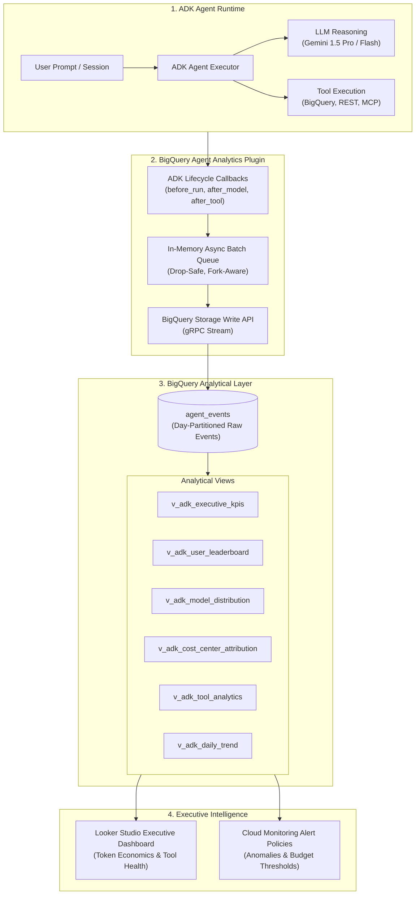

# 🧠 ADK BigQuery Agent Analytics Integration Guide

**Reference:** [ADK BigQuery Agent Analytics Plugin](https://adk.dev/integrations/bigquery-agent-analytics/)  
**Audience:** FinOps Analysts, Enterprise AI Architects, Lead Engineers, CTO Office  
**Scope:** Complete implementation and operational guide for capturing real-time agent execution telemetry, tool invocations, and token unit economics using Google's **Agent Development Kit (ADK)** and **Google BigQuery**.

---

## 📋 Table of Contents
1. [Executive Overview & Value Proposition](#-1-executive-overview--value-proposition)
2. [End-to-End Architectural Flow](#-2-end-to-end-architectural-flow)
3. [BigQuery Storage Write API Ingestion Engine](#-3-bigquery-storage-write-api-ingestion-engine)
4. [Captured Event Lifecycle & Telemetry Schema](#-4-captured-event-lifecycle--telemetry-schema)
5. [Python ADK Plugin Configuration & Code Recipes](#-5-python-adk-plugin-configuration--code-recipes)
6. [Pre-Calculated Analytical Views in BigQuery](#-6-pre-calculated-analytical-views-in-bigquery)
7. [Looker Studio Executive Dashboard Specification](#-7-looker-studio-executive-dashboard-specification)
8. [Production Deployment & Observability](#-8-production-deployment--observability)

---

## 🌟 1. Executive Overview & Value Proposition

Enterprise agents built on Google Cloud ADK (Agent Development Kit) perform complex multi-turn workflows: reasoning, invoking external APIs, querying databases, and retrieving knowledge from Vertex AI Search. 

The **BigQuery Agent Analytics Plugin (`BigQueryAgentAnalyticsPlugin`)** is Google's official telemetry plugin for ADK that streams fine-grained operational events directly into BigQuery.

### Key Capabilities:
- ⚡ **Zero-Latency Ingestion**: Uses the **BigQuery Storage Write API** for asynchronous, high-throughput batch streaming with zero impact on agent response latency.
- 🔍 **Distributed Tracing**: Native OpenTelemetry compatibility (`trace_id`, `span_id`, parent-child hierarchy) that seamlessly correlates BigQuery events with Google Cloud Trace.
- 🛠️ **Tool Provenance Tracking**: Distinguishes local functions, Model Context Protocol (MCP) tools, sub-agents, and remote Agent-to-Agent (A2A) transfers.
- 🏢 **Enterprise FinOps Attribution**: Injects SAP Cost Centers, internal application codes (`app_code`), environment, and authenticated user LDAPs into every token ledger entry.
- 📊 **Instant Looker Block Integration**: Ready-to-use dashboards visualizing agent interaction volume, P50–P99 latencies, tool error rates, and model cost footprints.

---

## 🏛️ 2. End-to-End Architectural Flow



---

## ⚡ 3. BigQuery Storage Write API Ingestion Engine

Rather than legacy HTTP streaming inserts, the plugin uses the **BigQuery Storage Write API**:
1. **gRPC Multiplexing**: Batch streams rows in binary format for high throughput.
2. **Exactly-Once Semantics**: Guarantees no duplicated events even during network retries.
3. **Dropped-Event Observability**: Exposes `plugin.get_drop_stats()` to track drop counts (e.g. `queue_full`, `retry_exhausted`) directly in Cloud Monitoring.
4. **Multiprocessing & Fork-Safety**: Sets `GRPC_ENABLE_FORK_SUPPORT=1` and handles Gunicorn/Uvicorn worker restarts without socket leaks.

---

## 📋 4. Captured Event Lifecycle & Telemetry Schema

The plugin automatically records the following core event types:

| Event Type | Trigger Point | Key Payload Fields Captured |
| :--- | :--- | :--- |
| `LLM_REQUEST` | Sent before dispatching prompt to model. | Prompt text, system instructions, temperature, top-p, safety settings. |
| `LLM_RESPONSE` | Received after model generation. | Candidate text, tool call directives, **promptTokenCount**, **candidatesTokenCount**, **cachedContentTokenCount**. |
| `TOOL_STARTED` | When the agent executes a function or MCP tool. | Tool name, input arguments, tool provenance (LOCAL, MCP, SUB_AGENT). |
| `TOOL_COMPLETED` | When the tool finishes execution. | Tool output/result, execution latency (ms), status (`SUCCESS` or `ERROR`). |
| `AGENT_TRANSFER` | When control passes to another specialized agent. | Source agent, destination agent, transfer context. |
| `HUMAN_IN_THE_LOOP`| When agent awaits user confirmation. | Action confirmation request, approved/rejected status. |

---

## 💻 5. Python ADK Plugin Configuration & Code Recipes

To instrument an enterprise agent in Python:

```python
import os
from google.adk.agents import Agent
from google.adk.models.google_llm import Gemini
from google.adk.plugins.bigquery_agent_analytics_plugin import (
    BigQueryAgentAnalyticsPlugin,
    BigQueryLoggerConfig
)
from google.adk.tools.bigquery import BigQueryToolset

PROJECT_ID = os.environ.get("GOOGLE_CLOUD_PROJECT", "aleorg-dev-workload-01")
DATASET_ID = "genai_finops_governance"

# 1. Configure the BigQuery Agent Analytics Plugin
bq_analytics_plugin = BigQueryAgentAnalyticsPlugin(
    project_id=PROJECT_ID,
    dataset_id=DATASET_ID,
    table_id="agent_events",
    config=BigQueryLoggerConfig(
        enabled=True,
        batch_size=10,
        shutdown_timeout=5.0,
        auto_schema_upgrade=True,     # Safely adds new columns as telemetry evolves
        create_views=True,            # Auto-creates query-friendly BigQuery views
        view_prefix="v_adk"
    )
)

# 2. Attach plugin to the ADK Agent Runtime
agent = Agent(
    name="light_attendance_copilot",
    model=Gemini(model_name="gemini-1.5-flash"),
    instruction="You are Light S/A's intelligent customer attendance assistant.",
    plugins=[bq_analytics_plugin],
    tools=[BigQueryToolset()]
)
```

---

## 📊 6. Pre-Calculated Analytical Views in BigQuery

The SQL definitions deployed in [`bigquery/adk_agent_analytics_views.sql`](file:///Users/alexandrade/codes/catlab/light/genai-token-governance/bigquery/adk_agent_analytics_views.sql) provide instant analytics:

```
┌──────────────────────────────────────┬────────────────────────────────────────────────────────┐
│ VIEW NAME                            │ BUSINESS PURPOSE                                       │
├──────────────────────────────────────┼────────────────────────────────────────────────────────┤
│ `v_adk_executive_kpis`               │ Executive scorecards (Tokens, Cost, Tool Success Rate) │
│ `v_adk_user_leaderboard`             │ Top consumers ranked by prompt/candidate token volumes │
│ `v_adk_model_distribution`           │ Gemini 1.5 Flash vs Pro vs 2.0 cost & volume shares    │
│ `v_adk_cost_center_attribution`      │ Financial allocation to SAP Cost Centers & App Codes   │
│ `v_adk_tool_analytics`               │ Tool execution volume, P50-P99 latency, error rates   │
│ `v_adk_daily_trend`                  │ 14-day historical trend of token growth and spend      │
└──────────────────────────────────────┴────────────────────────────────────────────────────────┘
```

---

## 🎨 7. Looker Studio Executive Dashboard Specification

The dashboard layout reproduces the customer's executive reporting requirements:

```
┌──────────────────────────────────────────────────────────────────────────────────────────────────────────┐
│  🧠 LIGHT S/A — ADK GENAI & TOKEN GOVERNANCE DASHBOARD                                                   │
├──────────────────────────────────────────────────────────────────────────────────────────────────────────┤
│                                                                                                          │
│  [ Active Sessions ]   [ Total Tokens ]       [ Cache Hit Rate ]   [ Tool Success % ]   [ Total AI Cost ] │
│        1,420                148.2 M                 34.2 %               98.5 %           $ 248.50 USD   │
│                                                                                                          │
├────────────────────────────────────────────────────┬─────────────────────────────────────────────────────┤
│  👤 TOP GENAI CONSUMERS (USER LEADERBOARD)         │  🤖 MODEL FAMILY VOLUME & COST DISTRIBUTION         │
│  ┌────────────────────────┬─────────────┬─────────┐│  ┌────────────────────────┬─────────────┬─────────┐ │
│  │ User / Email           │ Tokens (M)  │ Cost $  ││  │ Model Name             │ Tokens (M)  │ Share % │ │
│  ├────────────────────────┼─────────────┼─────────┤│  ├────────────────────────┼─────────────┼─────────┤ │
│  │ raphael_cano           │  42.1 M     │ $ 72.50 ││  │ gemini-1.5-flash       │ 104.2 M     │  70.3%  │ │
│  │ antonio_lameirao       │  28.4 M     │ $ 48.20 ││  │ gemini-1.5-pro         │  32.1 M     │  21.7%  │ │
│  │ mariana_souza          │  22.8 M     │ $ 38.10 ││  │ gemini-2.0-flash       │   8.4 M     │   5.7%  │ │
│  │ carlos_eduardo         │  18.7 M     │ $ 31.10 ││  │ text-embedding-004     │   3.5 M     │   2.3%  │ │
│  └────────────────────────┴─────────────┴─────────┘│  └────────────────────────┴─────────────┴─────────┘ │
├────────────────────────────────────────────────────┴─────────────────────────────────────────────────────┤
│  🏢 ERP FINANCIAL CHARGEBACK (SAP COST CENTERS & APP CODES)                                              │
│  ┌─────────────┬─────────────┬───────────────────────────┬──────────────┬──────────────────┐             │
│  │ Cost Center │ App Code    │ Application Name          │ Total Tokens │ Allocated Cost $ │             │
│  ├─────────────┼─────────────┼───────────────────────────┼──────────────┼──────────────────┤             │
│  │ 18207243    │ cds-34199   │ attendance_sac            │  58.4 M      │ $ 98.40          │             │
│  │ 18207041    │ cds-34242   │ energy_watch_grid         │  38.2 M      │ $ 64.10          │             │
│  │ 12272260    │ cds-59339   │ conexao_silvestre_pd      │  31.5 M      │ $ 52.80          │             │
│  │ 18206922    │ cds-77211   │ smart_meter_rag           │  20.1 M      │ $ 33.20          │             │
└──────────────────────────────────────────────────────────────────────────────────────────────────────────┘
```

---

## 🛡️ 8. Production Deployment & Observability

1. **Deploy Terraform**: Run `terraform apply` in [`terraform/`](file:///Users/alexandrade/codes/catlab/light/genai-token-governance/terraform/) to provision BigQuery and Log sinks.
2. **Run Demo Telemetry Generator**: Run `python3 src/generate_demo_telemetry.py` to seed sample events.
3. **Execute DDL Views**: Run [`bigquery/adk_agent_analytics_views.sql`](file:///Users/alexandrade/codes/catlab/light/genai-token-governance/bigquery/adk_agent_analytics_views.sql) in BigQuery Studio.
4. **Connect Looker Studio**: Follow the recipes in [`docs/LOOKER_STUDIO_DASHBOARD.md`](file:///Users/alexandrade/codes/catlab/light/genai-token-governance/docs/LOOKER_STUDIO_DASHBOARD.md).
