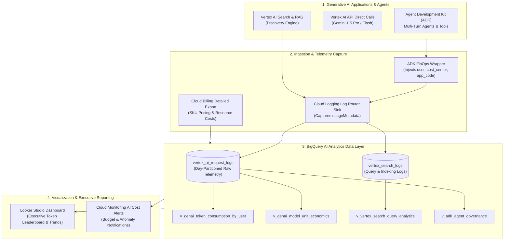

# 🏗️ GenAI Token Governance & Telemetry Architecture

**Audience:** Cloud Architects, AI Platform Engineers, FinOps Specialists  
**Scope:** Technical architecture for telemetry ingestion, log routing, BigQuery analytical modeling, and real-time dashboarding for Generative AI on Google Cloud.

---

## 🏛️ End-to-End System Architecture



---

## 🔍 1. Ingestion Mechanisms

To provide complete cost and token attribution without adding latency or breaking developer workflows, three complementary telemetry streams are ingested:

### Stream A: Cloud Logging Log Router Sink (Zero Latency)
Google Cloud automatically emits structured request and response metadata for Vertex AI endpoints and APIs. A **Cloud Logging Log Router Sink** filters these logs and streams them directly into BigQuery:

```sql
-- Cloud Logging Filter for Vertex AI & Gemini Models:
resource.type="aiplatform.googleapis.com/Endpoint" OR 
logName=~"projects/.*/logs/cloudaudit.googleapis.com%2Fdata_access" OR
jsonPayload.usageMetadata.totalTokenCount > 0
```

### Stream B: ADK Telemetry Wrapper (Application-Level Metadata)
Because API calls made through service accounts might lack the end-user identity or internal project codes (`app_code`, `cost_center`), the **ADK FinOps Wrapper** injects contextual metadata into log payloads or API request labels:
- `user`: Authenticated user email or LDAP (e.g. `raphael_cano`).
- `cost_center`: SAP Cost Center (e.g. `18207243`).
- `app_code`: Architecture identifier (e.g. `cds-34199`).
- `session_id`: Unique multi-turn agent session identifier.
- `agent_name` & `tool_name`: Sub-agent or function execution identifier.

### Stream C: Detailed Cloud Billing Export
BigQuery receives daily cost data with label attribution, enabling exact correlation between raw token volumes and financial invoice line items.

---

## 🗄️ 2. BigQuery Data Modeling Strategy

```
┌─────────────────────────────────────────────────────────────┐
│                    BigQuery AI Dataset                      │
│                `genai_finops_governance`                    │
├──────────────────────────────┬──────────────────────────────┤
│ RAW LOG TABLES               │ ANALYTICAL VIEWS             │
│ • `vertex_ai_request_logs`   │ • `v_genai_token_by_user`    │
│ • `vertex_search_logs`       │ • `v_genai_model_economics`  │
│ • `adk_agent_session_logs`   │ • `v_vertex_search_analytics`│
│ • `gcp_billing_export`       │ • `v_adk_agent_governance`   │
└──────────────────────────────┴──────────────────────────────┘
```

1. **Partitioning**: All raw tables are partitioned by `DATE(timestamp)` with 90-day retention to guarantee minimal storage cost.
2. **Clustering**: Tables are clustered by `user_id`, `app_code`, and `model_name` for millisecond Looker Studio query speeds.
3. **Views**: Analytical views abstract JSON parsing, compute token cost formulas, and calculate prompt vs. output ratios.
